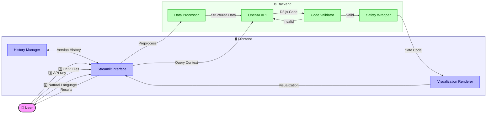

# 🎨 Comparative Visualization Generator

[](https://comparative-visualization-generator.streamlit.app/) 
[](https://www.python.org/downloads/)
[](https://d3js.org/)
[](https://openai.com/api/)

Generate interactive, comparative D3.js visualizations through natural language - no coding required!

## ✨ Features

- **📊 Comparative Visualizations** - Automatically compare data from two sources
- **🔄 Interactive D3.js** - All visualizations are interactive and web-ready
- **💬 Natural Language Interface** - Describe what you want in plain English
- **🔄 Iterative Refinement** - Continuously improve visualizations through conversation
- **📋 No Coding Required** - Technical complexity handled behind the scenes

## 🏗️ Architecture



## 🚀 How It Works

### 1️⃣ Enter your OpenAI API key
Connect to the OpenAI API to power the visualization generation engine.


### 2️⃣ Upload your data files
Provide two CSV files with matching schemas for comparison.


### 3️⃣ Create visualizations through conversation
Simply describe what you'd like to see in natural language.


### 4️⃣ Interact with your visualizations
Explore the data through interactive D3.js visualizations.


## 📋 Requirements

- Python 3.7+
- Streamlit
- OpenAI API key
- Internet connection for D3.js libraries

## 🔧 Installation

```bash
# Clone the repository
git clone https://github.com/yourusername/comparative-visualization-generator.git

# Navigate to project directory
cd comparative-visualization-generator

# Install dependencies
pip install -r requirements.txt

# Run the Streamlit app
streamlit run streamlit_app.py
```

## 🤝 Contributing

Contributions are welcome! Please feel free to submit a Pull Request.

## 📄 License

This project is licensed under the MIT License - see the LICENSE file for details.
