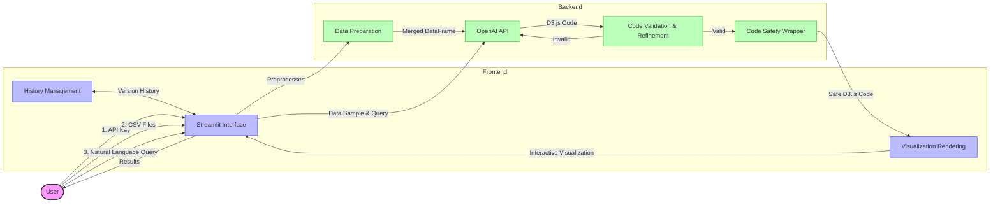

# 🎨 Comparative Visualization Generator

You can play with the [Live Demo](https://comparative-visualization-generator.streamlit.app/) here

## Architecture

## How it works?

1. Enter your Open AI API key

2. Upload 2 source files ( .csv ) with the same schema

3. Iteratively interact to re-generate visualizations based on the data through natural language queries

## Features

1. The nature of visualization will be comparative always
2. The visualizations are interactive because they are generated in D3.js
3. The user needs no coding experience to generate these visualizations
